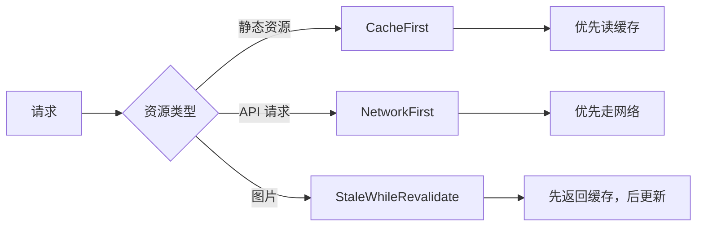

# vue-pure-admin PWA 配置方案

为 vue-pure-admin 后台管理系统添加 PWA（渐进式 Web 应用）支持，使应用具备离线访问、安装到桌面、推送通知等原生应用特性。

## 技术方案选型

> [!TIP]
> 推荐使用 **vite-plugin-pwa** 插件，这是 Vite 生态中最成熟的 PWA 解决方案，底层基于 Workbox。

| 方案                   | 优点                                    | 缺点               |
| ---------------------- | --------------------------------------- | ------------------ |
| **vite-plugin-pwa** ✅ | 零配置开箱即用，自动生成 SW 和 manifest | 灵活性稍低         |
| Workbox 直接使用       | 高度灵活                                | 配置复杂           |
| 手写 Service Worker    | 完全控制                                | 工作量大，容易出错 |

---

## 提议的变更

### 核心依赖

#### [NEW] package.json 依赖更新

```bash
pnpm add -D vite-plugin-pwa
```

新增开发依赖：

- `vite-plugin-pwa`: ^0.20.0+ (Vite PWA 插件)

---

### Vite 插件配置

#### [MODIFY] build/plugins.ts

在插件列表中添加 PWA 插件配置：

```diff
+ import { VitePWA } from "vite-plugin-pwa";

export function getPluginsList(
  VITE_CDN: boolean,
  VITE_COMPRESSION: ViteCompression
): PluginOption[] {
  return [
    // ... 现有插件 ...
+   VitePWA({
+     registerType: "autoUpdate",
+     includeAssets: ["favicon.ico", "logo.png"],
+     manifest: {
+       name: "DTSP",
+       short_name: "DTSP",
+       description: "DTSP数字技术服务平台",
+       theme_color: "#409EFF",
+       background_color: "#ffffff",
+       display: "standalone",
+       start_url: "/",
+       icons: [
+         {
+           src: "pwa-192x192.png",
+           sizes: "192x192",
+           type: "image/png"
+         },
+         {
+           src: "pwa-512x512.png",
+           sizes: "512x512",
+           type: "image/png"
+         },
+         {
+           src: "pwa-512x512.png",
+           sizes: "512x512",
+           type: "image/png",
+           purpose: "maskable"
+         }
+       ]
+     },
+     workbox: {
+       globPatterns: ["**/*.{js,css,html,ico,png,svg,woff2}"],
+       runtimeCaching: [
+         {
+           urlPattern: /^https:\/\/api\..*/i,
+           handler: "NetworkFirst",
+           options: {
+             cacheName: "api-cache",
+             expiration: {
+               maxEntries: 100,
+               maxAgeSeconds: 60 * 60 * 24 // 24小时
+             }
+           }
+         }
+       ]
+     }
+   })
  ];
}
```

---

### PWA 图标资源

#### [NEW] public/pwa-192x192.png

#### [NEW] public/pwa-512x512.png

基于现有的 `logo.png` 生成不同尺寸的 PNG 图标：

| 文件名            | 尺寸    | 用途                         |
| ----------------- | ------- | ---------------------------- |
| `pwa-192x192.png` | 192×192 | Android 主屏幕图标           |
| `pwa-512x512.png` | 512×512 | 高分辨率设备 / maskable 图标 |

> [!NOTE]
> 建议使用 [pwa-asset-generator](https://github.com/niclin/pwa-asset-generator) 或在线工具从 SVG 生成所有必需的图标尺寸。

---

### HTML 元标签更新

#### [MODIFY] index.html

添加 PWA 必需的 meta 标签：

```diff
  <head>
    <meta charset="UTF-8" />
    <meta http-equiv="X-UA-Compatible" content="IE=edge,chrome=1" />
    <meta name="renderer" content="webkit" />
    <meta
      name="viewport"
      content="width=device-width,initial-scale=1.0,minimum-scale=1.0,maximum-scale=1.0,user-scalable=0"
    />
+   <meta name="description" content="Vue Pure Admin 后台管理系统" />
+   <meta name="theme-color" content="#409EFF" />
+   <link rel="apple-touch-icon" href="/pwa-192x192.png" />
    <title>vue-pure-admin</title>
    <link rel="icon" href="/favicon.ico" />
  </head>
```

---

### TypeScript 类型声明

#### [MODIFY] types/global.d.ts（如需要）

添加 PWA 虚拟模块的类型声明：

```typescript
/// <reference types="vite-plugin-pwa/client" />
```

---

## 配置选项说明

### Service Worker 注册策略

| 策略             | 行为                     | 推荐场景     |
| ---------------- | ------------------------ | ------------ |
| `autoUpdate` ✅  | 后台自动更新，刷新后生效 | 后台管理系统 |
| `prompt`         | 提示用户手动更新         | 内容类网站   |
| `injectManifest` | 完全自定义 SW            | 高级场景     |

### Workbox 缓存策略



---

## 验证计划

### 自动化验证

1. **构建验证**

   ```bash
   pnpm run build
   ```

   检查 `dist/` 目录是否包含：
   - `sw.js` (Service Worker 文件)
   - `manifest.webmanifest` (PWA 清单文件)
   - `pwa-*.png` (图标文件)

2. **开发环境验证**

   ```bash
   pnpm run dev
   ```

   访问 `http://localhost:8848` 并打开 DevTools → Application → Service Workers 检查注册状态。

### 手动验证

1. **PWA 可安装性测试**
   - 使用 Chrome 打开构建后的应用
   - 打开 DevTools → Lighthouse
   - 运行 PWA 审计
   - 确保所有 PWA 项目通过

2. **离线功能测试**
   - 构建并预览应用：`pnpm run preview:build`
   - 在 DevTools → Network 中设置 Offline
   - 刷新页面，确认应用仍可访问

---

## 可选增强功能

根据需要可以后续添加：

| 功能        | 说明                   | 复杂度 |
| ----------- | ---------------------- | ------ |
| 🔔 推送通知 | 需要后端配合           | 高     |
| 📲 安装提示 | 自定义安装横幅         | 中     |
| 🔄 更新提示 | 提示用户刷新获取新版本 | 低     |
| 📱 启动画面 | 自定义 splash screen   | 低     |

---

## 预期产出文件

```text

public/
├── favicon.ico       (已存在)
├── logo.png          (已存在)
├── pwa-192x192.png   [新增]
└── pwa-512x512.png   [新增]

build/
└── plugins.ts        [修改 - 添加 VitePWA 插件]

index.html            [修改 - 添加 PWA meta 标签]

dist/ (构建后)
├── sw.js             [自动生成]
├── manifest.webmanifest [自动生成]
└── workbox-*.js      [自动生成]
```
